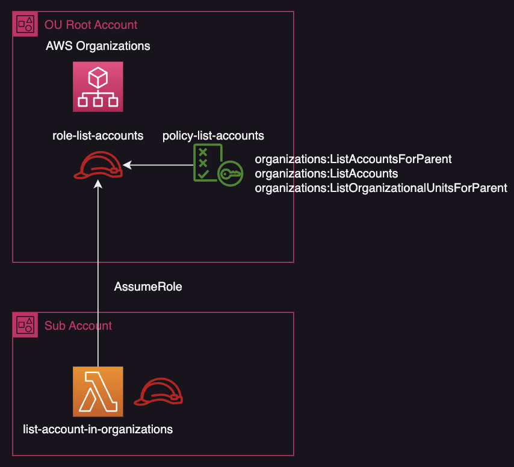

# Get account info within AWS organizations.

### Design.

### Ready for deploy
Create s3 bucket to SubAccount, for upload lambda source.

### Rewrite template files.
- RootAccount/cfn-list-account-role.yaml
  - Set `SubAccountId` to the value of Sub Acccount Id. 
- SubAccount/cfn-list-account-function.yaml
  - Set `OuRootAccountId` to the value of Root Acccount Id. 
- SubAccount/deploy_command.txt
  - Set `SOURCE_UPLOAD_BUCKET` to the value of source bucket name. 

### Deploy
1. Create Lambda on SubAccount by CloudFormation.
2. Create Role for AssumeRole on RootAccount by CloudFormation.

### How to use
- Open lambda on subaccount's management console.
- Execute test on test console with below parameter.
   - { "ou-id" : "xxxxxxxxxx" } <- organizations id.
